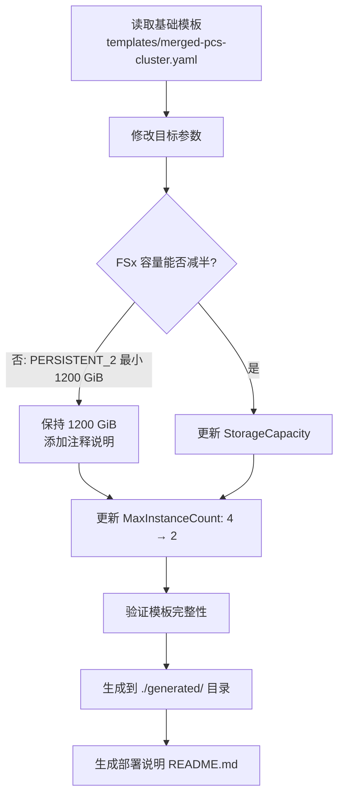
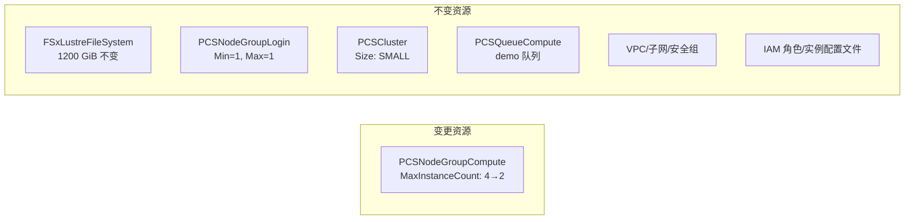

# 设计文档：集群规模缩减 (cluster-scale-down)

## 概述

本功能通过修改现有 CloudFormation 模板来实现 AWS PCS 集群的规模缩减。核心变更是将计算节点组 `compute-1` 的 `MaxInstanceCount` 从 4 减少到 2。由于 FSx Lustre PERSISTENT_2 部署类型的最小存储容量为 1200 GiB，存储容量无法进一步缩减，保持不变。

变更范围：
- **计算节点组**：MaxInstanceCount 4 → 2
- **FSx Lustre 存储**：保持 1200 GiB 不变（已是 PERSISTENT_2 最小值）
- **其他配置**：Login 节点组、集群大小、网络、安全组、IAM 等全部保持不变

生成策略：基于 `templates/merged-pcs-cluster.yaml` 基础模板，复制并修改后输出到 `./generated/` 目录。

## 架构

本功能不涉及运行时架构变更，仅涉及 CloudFormation 模板的静态修改和文件生成。

### 模板生成流程



### 变更影响范围



## 组件与接口

### 输入

| 组件 | 路径 | 说明 |
|------|------|------|
| 基础模板 | `templates/merged-pcs-cluster.yaml` | 当前集群的完整 CloudFormation 模板 |

### 输出

| 组件 | 路径 | 说明 |
|------|------|------|
| 缩减模板 | `./generated/pcs-cluster-{timestamp}.yaml` | 修改后的 CloudFormation 模板 |
| 部署说明 | `./generated/README.md` | 记录所有变更内容的部署文档 |

### 模板修改点

仅需修改基础模板中的一个资源属性：

```yaml
# 修改前 (基础模板)
PCSNodeGroupCompute:
  Type: AWS::PCS::ComputeNodeGroup
  Properties:
    ScalingConfiguration:
      MinInstanceCount: 0
      MaxInstanceCount: 4  # ← 当前值

# 修改后 (缩减模板)
PCSNodeGroupCompute:
  Type: AWS::PCS::ComputeNodeGroup
  Properties:
    ScalingConfiguration:
      MinInstanceCount: 0
      MaxInstanceCount: 2  # ← 新值
```

### FSx Lustre 存储说明

FSx Lustre PERSISTENT_2 部署类型的最小存储容量为 1200 GiB。当前配置已是最小值，无法进一步缩减。需在模板中添加注释说明：

```yaml
# 注意：FSx Lustre PERSISTENT_2 部署类型最小容量为 1200 GiB，无法进一步缩减
FSxCapacity:
  Type: Number
  Default: 1200
  Description: Storage capacity in GiB (PERSISTENT_2 minimum is 1200 GiB)
  MinValue: 1200
  MaxValue: 100800
```

## 数据模型

本功能不涉及新的数据模型。操作对象为 CloudFormation YAML 模板文件，关键数据结构如下：

### 变更参数映射

| 参数路径 | 原始值 | 目标值 | 说明 |
|----------|--------|--------|------|
| `Resources.PCSNodeGroupCompute.Properties.ScalingConfiguration.MaxInstanceCount` | 4 | 2 | 计算节点最大实例数减半 |
| `Parameters.FSxCapacity.Default` | 1200 | 1200 | 保持不变（已是最小值） |
| `Parameters.FSxCapacity.Description` | 原描述 | 含最小值说明的新描述 | 添加 PERSISTENT_2 限制说明 |

### 不变参数确认

| 参数路径 | 保持值 | 说明 |
|----------|--------|------|
| `Resources.PCSNodeGroupCompute.Properties.ScalingConfiguration.MinInstanceCount` | 0 | 动态缩放最小值 |
| `Resources.PCSNodeGroupLogin.Properties.ScalingConfiguration.MinInstanceCount` | 1 | Login 节点始终运行 |
| `Resources.PCSNodeGroupLogin.Properties.ScalingConfiguration.MaxInstanceCount` | 1 | Login 节点固定 1 个 |
| `Resources.PCSCluster.Properties.Size` | SMALL | 集群控制器大小 |
| `Resources.FSxLustreFileSystem.Properties.StorageCapacity` | `!Ref FSxCapacity` | 引用参数值 |
| `Mappings.Architecture.ComputeNodeInstances` | c6i.xlarge / c7g.xlarge | 实例类型不变 |

## 错误处理

### 模板生成阶段

| 错误场景 | 处理方式 |
|----------|----------|
| 基础模板文件不存在 | 终止生成，提示用户检查 `templates/merged-pcs-cluster.yaml` 是否存在 |
| `./generated/` 目录不存在 | 自动创建目录 |
| 生成的 YAML 语法无效 | 生成后进行 YAML 语法验证，确保模板可被 CloudFormation 解析 |
| 文件写入权限不足 | 提示用户检查目录权限 |

### 部署阶段（文档中说明）

| 错误场景 | 处理建议 |
|----------|----------|
| MaxInstanceCount 小于当前运行实例数 | 需先等待运行中的作业完成或手动终止多余实例 |
| CloudFormation 更新回滚 | 检查 CloudFormation 事件日志，确认变更兼容性 |
| 参数验证失败 | 确认参数值在 AllowedValues/MinValue/MaxValue 范围内 |

## 测试策略

### PBT 适用性评估

本功能属于基础设施即代码（IaC）模板修改，核心操作是 CloudFormation YAML 文件的静态编辑和生成。根据 PBT 适用性准则，IaC 配置修改不适合属性基测试，原因如下：

- 操作是声明式配置修改，不是具有输入/输出行为的纯函数
- 变更点固定且有限（仅 MaxInstanceCount 一处实质变更）
- 无需对大量随机输入进行验证

因此，本功能跳过正确性属性（Correctness Properties）部分，采用以下测试策略。

### 单元测试（示例基测试）

针对生成模板的关键验证点编写示例基测试：

1. **MaxInstanceCount 变更验证**：解析生成的 YAML，确认 `PCSNodeGroupCompute.ScalingConfiguration.MaxInstanceCount` 值为 2
2. **MinInstanceCount 不变验证**：确认 `PCSNodeGroupCompute.ScalingConfiguration.MinInstanceCount` 值为 0
3. **Login 节点不变验证**：确认 `PCSNodeGroupLogin.ScalingConfiguration` 的 Min 和 Max 均为 1
4. **集群大小不变验证**：确认 `PCSCluster.Size` 为 SMALL
5. **FSx 容量不变验证**：确认 `FSxCapacity.Default` 为 1200，`MinValue` 为 1200
6. **FSx 吞吐量不变验证**：确认 `FSxPerUnitStorageThroughput.Default` 为 125
7. **实例类型不变验证**：确认 Mappings 中 ComputeNodeInstances 和 LoginNodeInstances 未被修改
8. **队列关联不变验证**：确认 `PCSQueueCompute` 仍关联 `PCSNodeGroupCompute`

### 模板验证测试

1. **YAML 语法验证**：生成的模板可被 YAML 解析器正确解析
2. **CloudFormation 语法验证**：使用 `aws cloudformation validate-template` 验证模板有效性
3. **资源完整性验证**：确认生成模板包含与基础模板相同的所有资源逻辑 ID

### 文件生成验证

1. **输出路径验证**：确认模板生成到 `./generated/` 目录
2. **文件名格式验证**：确认文件名符合 `pcs-cluster-{timestamp}.yaml` 格式
3. **README 生成验证**：确认 `./generated/README.md` 已生成且包含变更说明

### 手动验证清单

- [ ] 使用 `diff` 对比基础模板和生成模板，确认仅有预期变更
- [ ] 使用 `aws cloudformation validate-template` 验证模板
- [ ] 审查 `./generated/README.md` 中的变更记录是否准确完整
